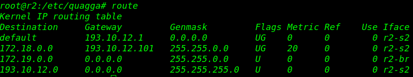

# 一、网络架构搭建

## 1.软件安装

- docker安装

```bash  
apt install docker.io
```

- k3d安装

``` bash
vim install.sh
写入https://raw.githubusercontent.com/k3d-io/k3d/main/install.sh的内容
chmod +x install.sh
./install.sh
```

- ovs安装

```bash 
apt install openvswitch-switch
```

- kathara安装

```bash
apt-key adv --keyserver keyserver.ubuntu.com --recv-keys 21805A48E6CBBA6B991ABE76646193862B759810
add-apt-repository ppa:katharaframework/kathara
apt update
apt install kathara
#拉取镜像
docker pull kathara/quagga
```

` 教程：https://github.com/KatharaFramework/Kathara-Labs`

## 2.建立集群与网关连接
- 整体拓扑结构


- 建立集群与网关

```bash
k3d cluster create c1 --registry-create c1-registry -s 1 -a 3
kathara vstart -n r1

k3d cluster create c2 --registry-create c2-registry
kathara vstart -n r2
```

- 连接集群与网关

```bash
ip addr del 172.18.0.1/16 dev 集群c1网桥

#检索网关docker容器namespace
docker inspect --format '{{ .State.Pid }}' 网关r1容器ID
25048
mkdir -p /var/run/netns
ln -s /proc/25048/ns/net /var/run/netns/r1

#建立一对veth
ip link add br-r1 type veth peer name r1-br
brctl addif 集群c1网桥 br-r1
ifconfig br-r1 up
ip link set r1-br netns r1

#进入r1
ifconfig r1-br up
ip addr add 172.18.0.1/16 dev r1-br
```

```bash
ip addr del 172.19.0.1/16 dev 集群c2网桥

#检索网关docker容器namespace
docker inspect --format '{{ .State.Pid }}' 网关r2容器ID
25048
ln -s /proc/25048/ns/net /var/run/netns/r2

#建立一对veth
ip link add br-r2 type veth peer name r2-br
brctl addif 集群c2网桥 br-r2
ifconfig br-r2 up
ip link set r2-br netns r2

#进入r2
ifconfig r2-br up
ip addr add 172.19.0.1/16 dev r2-br
```

## 3.ovs拓扑搭建

- 建立ovs之间连接

 ``` bash
ovs-vsctl add-br s1
ovs-vsctl set bridge s1 protocols=OpenFlow10,OpenFlow11,OpenFlow12,OpenFlow13,OpenFlow14
ovs-vsctl add-port s1 s1p1
ovs-vsctl set Interface s1p1 type=patch
ovs-vsctl set Interface s1p1 options:peer=s2p1
ovs-vsctl add-br s2
ovs-vsctl set bridge s2 protocols=OpenFlow10,OpenFlow11,OpenFlow12,OpenFlow13,OpenFlow14
ovs-vsctl add-port s2 s2p1
ovs-vsctl set Interface s2p1 type=patch
ovs-vsctl set Interface s2p1 options:peer=s1p1
 ```

- 建立ovs与网关连接

```bash
ip link add s1-r1 type veth peer name r1-s1
ifconfig s1-r1 up
ovs-vsctl add-port s1 s1-r1
ip link set r1-s1 netns r1

#进入r1
ifconfig r1-s1 up
ip addr add 193.10.11.1/24 dev r1-s1
//route add -net 0.0.0.0 gw 193.10.11.1（不配，没意义）
```

```bash
ip link add s2-r2 type veth peer name r2-s2
ifconfig s2-r2 up
ovs-vsctl add-port s2 s2-r2
ip link set r2-s2 netns r2

#进入r2
ifconfig r2-s2 up
ip addr add 193.10.12.1/24 dev r2-s2
//route add -net 0.0.0.0 gw 193.10.12.1（不配，没意义）
```

- 连接onos控制器

```bash
docker pull onosproject/onos
docker run -p 8181:8181 --name onos-ui -d onosproject/onos:latest
ssh -p 8101 karaf@172.17.0.4（onos容器IP，docker network查看）
app activate org.onosproject.openflow
ovs-vsctl set-controller s1 tcp:172.17.0.4:6653
ovs-vsctl set-controller s2 tcp:172.17.0.4:6653
app activate org.onosproject.fwd（开启转发）
```

## 4.配置BGP

- 创建BGP Speaker

```bash
kathara vstart -n rspk
```

``` bash
ip link add s1-rspk type veth peer name rspk-s1
ifconfig s1-rspk up
ovs-vsctl add-port s1 s1-rspk
ip link set rspk-s1 netns rspk

#进入rspk
ifconfig rspk-s1 up
ip addr add 193.10.11.101/24 dev rspk-s1
```

```bash
ip link add s2-rspk type veth peer name rspk-s2
ifconfig s2-rspk up
ovs-vsctl add-port s2 s2-rspk
ip link set rspk-s2 netns rspk

#进入rspk
ifconfig rspk-s2 up
ip addr add 193.10.12.101/24 dev rspk-s2
```

```bash
ip link add doc-rspk type veth peer name rspk-doc
ifconfig doc-rspk up
brctl addif docker0 doc-rspk
ip link set rspk-doc netns rspk

#进入rspk
ifconfig rspk-doc up
ip addr add 172.17.0.104/24 dev rspk-doc
```

```bash
#进入rspk
cd /etc/quagga
vim daemons
zebra=yes
bgpd=yes
ospfd=no
ospf6d=no
ripd=no
ripngd=no

vim bgpd.conf
!
hostname bgpd
password zebra
enable password zebra
!
router bgp 3
neighbor 193.10.11.1 remote-as 1
neighbor 193.10.11.1 description Router 1 of AS1
neighbor 193.10.11.1 ebgp-multihop
neighbor 193.10.12.1 remote-as 2
neighbor 193.10.12.1 description Router 2 of AS2
neighbor 193.10.12.1 ebgp-multihop
neighbor 172.17.0.4 remote-as 3
neighbor 172.17.0.4 description Router3  of AS3
neighbor 172.17.0.4 port 2000
!
log file /var/log/zebra/bgpd.log
!
debug bgp
debug bgp events
debug bgp filters
debug bgp fsm
debug bgp keepalives
debug bgp updates 
!
```

- r1配置BGP

```bash
#进入r1
cd /etc/quagga
vim daemons
zebra=yes
bgpd=yes
ospfd=no
ospf6d=no
ripd=no
ripngd=no

vim bgpd.conf
!
hostname bgpd
password zebra
enable password zebra
!
router bgp 1
network 172.18.0.0/16
neighbor 193.10.11.101 remote-as 3
neighbor 193.10.11.101 description Router 3 of AS3
neighbor 193.10.11.101 ebgp-multihop
!
log file /var/log/zebra/bgpd.log
!
debug bgp
debug bgp events
debug bgp filters
debug bgp fsm
debug bgp keepalives
debug bgp updates 
!
```

- r2配置BGP

```bash
#进入r2
cd /etc/quagga
vim daemons
zebra=yes
bgpd=yes
ospfd=no
ospf6d=no
ripd=no
ripngd=no

vim bgpd.conf
!
hostname bgpd
password zebra
enable password zebra
!
router bgp 2
network 172.19.0.0/16
neighbor 193.10.12.101 remote-as 3
neighbor 193.10.12.101 description Router 3 of AS3
neighbor 193.10.12.101 ebgp-multihop
!
log file /var/log/zebra/bgpd.log
!
debug bgp
debug bgp events
debug bgp filters
debug bgp fsm
debug bgp keepalives
debug bgp updates 
!
```

- onos开启sdn-ip

```bash
ssh -p 8101 karaf@172.17.0.4
app activate org.onosproject.config
app activate org.onosproject.proxyarp
app activate org.onosproject.sdnip
```

- 启动zebra、bgpd

```bash
#分别进入rspk、r1、r2
cd /etc/init.d
./quagga start
```

- 查看路由表





## 5.可编程算力网络

- P4拓扑搭建


```bash
vim lab.conf
h1[0]="A"
h1[image]="kathara/quagga"

h2[0]="C"
h2[image]="kathara/quagga"

s1[0]="A"
s1[1]="B"
s1[image]="kathara/p4"

s2[0]="B"
s2[1]="C"
s2[image]="kathara/p4"
```

```bash
vim h1.startup
ip link set eth0 address 00:00:00:00:01:01
ip addr add 10.0.1.1/24 dev eth0
ip r add 10.0.2.0/24 dev eth0
arp -s 10.0.2.2 00:00:0a:00:01:01
```

```bash
vim h2.startup
ip link set eth0 address 00:00:00:00:02:02
ip addr add 10.0.2.2/24 dev eth0
ip r add 10.0.1.0/24 dev eth0
arp -s 10.0.1.1 00:00:0a:00:02:02
```

```bash
vim s1.startup
ip link set eth1 address 00:00:00:01:02:00
ip link set eth0 address 00:00:0a:00:01:01

p4c /shared/l3_basic_forwarding.p4 -o /
simple_switch -i 1@eth0 -i 2@eth1 l3_basic_forwarding.json &

while [[ $(pgrep simple_switch) -eq 0 ]]; do sleep 1; done
until simple_switch_CLI <<< "help"; do sleep 1; done

simple_switch_CLI <<< $(cat commands.txt)
```

```bash
vim s2.startup
ip link set eth1 address 00:00:0a:00:02:02
ip link set eth0 address 00:00:00:02:01:00

p4c  /shared/l3_basic_forwarding.p4 -o /
simple_switch -i 1@eth0 -i 2@eth1 l3_basic_forwarding.json &

while [[ $(pgrep simple_switch) -eq 0 ]]; do sleep 1; done
until simple_switch_CLI <<< "help"; do sleep 1; done

simple_switch_CLI <<< $(cat commands.txt)
```

```bash
mkdir s1
cd s1
vim commands.txt
table_set_default ipv4_lpm drop
table_add ipv4_lpm ipv4_forward 10.0.1.1/32 => 00:00:00:00:01:01 1
table_add ipv4_lpm ipv4_forward 10.0.2.2/32 => 00:00:00:02:01:00 2
```

```bash
mkdir s2
cd s2
vim commands.txt
table_set_default ipv4_lpm drop
table_add ipv4_lpm ipv4_forward 10.0.1.1/32 => 00:00:00:01:02:00 1
table_add ipv4_lpm ipv4_forward 10.0.2.2/32 => 00:00:00:00:02:02 2
```

```bash
mkdir shared
cd shared
vim l3_basic_forwarding.p4
/* -*- P4_16 -*- */
#include <core.p4>
#include <v1model.p4>

const bit<16> TYPE_IPV4 = 0x800;

/*************************************************************************
*********************** H E A D E R S  ***********************************
*************************************************************************/

typedef bit<9>  egressSpec_t;
typedef bit<48> macAddr_t;
typedef bit<32> ip4Addr_t;

header ethernet_t {
    macAddr_t dstAddr;
    macAddr_t srcAddr;
    bit<16>   etherType;
}

header ipv4_t {
    bit<4>    version;
    bit<4>    ihl;
    bit<8>    diffserv;
    bit<16>   totalLen;
    bit<16>   identification;
    bit<3>    flags;
    bit<13>   fragOffset;
    bit<8>    ttl;
    bit<8>    protocol;
    bit<16>   hdrChecksum;
    ip4Addr_t srcAddr;
    ip4Addr_t dstAddr;
}

struct metadata {
    /* empty */
}

struct headers {
    ethernet_t   ethernet;
    ipv4_t       ipv4;
}

/*************************************************************************
*********************** P A R S E R  ***********************************
*************************************************************************/

parser MyParser(packet_in packet,
                out headers hdr,
                inout metadata meta,
                inout standard_metadata_t standard_metadata) {

    state start {

        packet.extract(hdr.ethernet);
        transition select(hdr.ethernet.etherType){

            TYPE_IPV4: ipv4;
            default: accept;

        }

    }

    state ipv4 {

        packet.extract(hdr.ipv4);
        transition accept;
    }

}


/*************************************************************************
************   C H E C K S U M    V E R I F I C A T I O N   *************
*************************************************************************/

control MyVerifyChecksum(inout headers hdr, inout metadata meta) {
    apply {  }
}


/*************************************************************************
**************  I N G R E S S   P R O C E S S I N G   *******************
*************************************************************************/

control MyIngress(inout headers hdr,
                  inout metadata meta,
                  inout standard_metadata_t standard_metadata) {

    action drop() {
        mark_to_drop(standard_metadata);
    }

    action ipv4_forward(macAddr_t dstAddr, egressSpec_t port) {

        //set the src mac address as the previous dst
        hdr.ethernet.srcAddr = hdr.ethernet.dstAddr;

       //set the destination mac address that we got from the match in the table
        hdr.ethernet.dstAddr = dstAddr;

        //set the output port that we also get from the table
        standard_metadata.egress_spec = port;

        //decrease ttl by 1
        hdr.ipv4.ttl = hdr.ipv4.ttl -1;

    }

    table ipv4_lpm {
        key = {
            hdr.ipv4.dstAddr: lpm;
        }
        actions = {
            ipv4_forward;
            drop;
            NoAction;
        }
        size = 1024;
        default_action = NoAction();
    }

    apply {

        //only if IPV4 the rule is applied. Therefore other packets will not be forwarded.
        if (hdr.ipv4.isValid()){
            ipv4_lpm.apply();

        }
    }
}

/*************************************************************************
****************  E G R E S S   P R O C E S S I N G   *******************
*************************************************************************/

control MyEgress(inout headers hdr,
                 inout metadata meta,
                 inout standard_metadata_t standard_metadata) {
    apply {  }
}

/*************************************************************************
*************   C H E C K S U M    C O M P U T A T I O N   **************
*************************************************************************/

control MyComputeChecksum(inout headers hdr, inout metadata meta) {
     apply {
	update_checksum(
	    hdr.ipv4.isValid(),
            { hdr.ipv4.version,
	      hdr.ipv4.ihl,
              hdr.ipv4.diffserv,
              hdr.ipv4.totalLen,
              hdr.ipv4.identification,
              hdr.ipv4.flags,
              hdr.ipv4.fragOffset,
              hdr.ipv4.ttl,
              hdr.ipv4.protocol,
              hdr.ipv4.srcAddr,
              hdr.ipv4.dstAddr },
            hdr.ipv4.hdrChecksum,
            HashAlgorithm.csum16);
    }
}


/*************************************************************************
***********************  D E P A R S E R  *******************************
*************************************************************************/

control MyDeparser(packet_out packet, in headers hdr) {
    apply {

        //parsed headers have to be added again into the packet.
        packet.emit(hdr.ethernet);
        packet.emit(hdr.ipv4);

    }
}

/*************************************************************************
***********************  S W I T C H  *******************************
*************************************************************************/

//switch architecture
V1Switch(
MyParser(),
MyVerifyChecksum(),
MyIngress(),
MyEgress(),
MyComputeChecksum(),
MyDeparser()
) main;
```

```bash
kathara lstart
```
